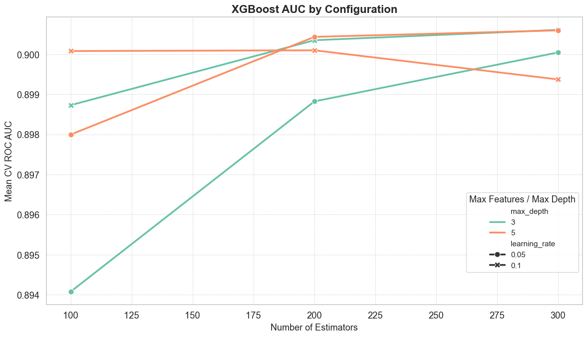

# ML-health-analysis
# Predicting Health Outcomes with Machine Learning

This project explores how machine learning models can predict self-reported health status using the Behavioral Risk Factor Surveillance System (BRFSS) data from the CDC. It showcases a full data science pipeline including data cleaning, feature engineering, model training, and interpretation.

## 📊 Project Overview

- **Dataset**: BRFSS 2015 survey data (sampled to 100,000 rows for efficiency). The dataset is not uploaded due to size limit, but can be found at:https://www.cdc.gov/brfss/annual_data/annual_data.htm
- **Target Variable**: `_RFHLTH` – a self-reported rating of general health (1 = Good/Better Health and 2 = Fair/Poor Health)
- **Models Used**:
  - Logistic Regression
  - Decision Tree
  - Random Forest Classifier
  - XGBoost

The objective is to predict a respondent’s self reported general health based on other numeric health and behavior-related variables. Then compare performance of model precision to find the best model.

## 🔍 Key Steps

- **Data Cleaning and Manipulation**:
  - removal of irrelevant and less important features
  - feature recoding (e.g. conversion of 1/2 -> 0/1, filling in NaN values by averaging)
  - identification of universal/conditional features and separate engineering
  
- **Testing and Fine Tuning of Multiple Models**:
  - Logistic Regression
  - Decision Tree
  - Random Forest (varying number of estimators, maximum depth and maximum features)
  - XGBoost (varying number of estimators, maximum depth and learning rate)

- **Performance Comparison and Insight Extraction**:
  - graph the AUC-ROC curve
  - list and cross-match feature importance

## 📈 Results Summary

### Logistic Regression
pseudo R-squared: 0.364

*Table 1: Top 5 Positive/Negative Variables for Logistic Regressions*
  
| Feature   |   Coefficient |   Std Error |   P-value | Direction   |
|:----------|--------------:|------------:|----------:|:------------|
| _RFHYPE5  |         0.388 |       0.173 |     0.025 | Positive    |
| EXERANY2  |         0.366 |       0.165 |     0.026 | Positive    |
| DIABETE3  |         0.291 |       0.013 |     0     | Positive    |
| EDUCA     |         0.285 |       0.023 |     0     | Positive    |
| INTERNET  |         0.261 |       0.028 |     0     | Positive    |
| QLACTLM2  |        -0.768 |       0.027 |     0     | Negative    |
| CHCCOPD1  |        -0.548 |       0.034 |     0     | Negative    |
| CHCOCNCR  |        -0.542 |       0.031 |     0     | Negative    |
| CHCKIDNY  |        -0.508 |       0.047 |     0     | Negative    |
| DIFFWALK  |        -0.466 |       0.03  |     0     | Negative    |

The results make intuitive sense, most of these variables ask for participants' physical conditons and disease history

For example:

`QLACTLM2` asks if you are limited in any way due to physical and mental inabilities, we find that answering 'yes' on this question decreases the odds of participant thinking they have good health by 1 - e^(-0.768) = 53.6%.

`EXERANY2` asks if participants engaged in physical activities such as jogging in the past month. Those who answer 'yes' has a e^0.366 - 1 = 44% of odds increase of reporting good health.

Some interesting observations include:

`EDUCA` which is positively related to subjects education level and `INTERNET` which tracks internet usage in the past month. They all seem to positively affect 

One can say that higher education and usage of internet allows for access to more health-related information, which may facilitate the adoption of healthier habits. However, there is no way to verify such claim.

A significant downside of Logistic Regression is that it cannot include columns with NaN values. In our context, it means that every conditional variable must be omitted to run this regression.

### Decision Tree

*Figure 1: Visualisation of Decision Tree Branches*

*Figure 2: Confusion Matrix for Decison Tree Model*

The confusion matrix shows that around 87% of results are correctly predicted using this model. It is important to note that we have an imbalanced dataset where the majority of individuals report good/better health. In this case, accuracy is not the best measure for model performance. we have to introduce the ROC-AUC curve as a more robust indicator.

### Random Forest

*Figure 3: Confusion Matrix for the Initial Random Forest Model*

We compute the confusion matrix of a Random Forest model (n_estimators = 100, max_depth = None, max_features = 'sqrt'), we can see that it slightly outperforms the Decision Tree model.
This result is expected since Random Forest uses multiple trees to reduce overfitting and stablize prediction.

*Figure 4: Performance Comparison of Different Random Forest Models*

We then test different combinations of model parameters to find the best performing model. From the figure, we can see that

(n_estimators = 300, max_depth = 20, max_features = 'sqrt')
gives the highest ROC AUC at 0.893.

We then proceed to generate the list of the 10 most important features.

*Table 2: 10 Most Important Features in Best Random Forest Model*
| Rank | Feature         | Importance |
|------|------------------|------------|
| 1    | PHYSHLTH         | 0.0937     |
| 2    | DIFFWALK         | 0.0453     |
| 3    | QLACTLM2         | 0.0361     |
| 4    | DIFFALON         | 0.0291     |
| 5    | ARTHSOCL         | 0.0216     |
| 6    | _BMI5            | 0.0193     |
| 7    | MENTHLTH         | 0.0188     |
| 8    | USEEQUIP         | 0.0187     |
| 9    | JOINPAIN         | 0.0185     |
| 10   | _VEGESUM         | 0.0168     |

### XGBoost

*Figure 5: Performance Comparison of Different XGBoost Models*

We iterate the same process for XGBoost models and find that

(n_estimators = 300, max_depth = 5, learning_rate = 0.1) gives the highest ROC AUC at 0.900 

We then proceed to generate the list of the 10 most important features.

*Table 3: 10 Most Important Features in Best XGBoost Model*
| Rank | Feature         | Importance |
|------|------------------|------------|
| 1    | PHYSHLTH         | 0.1271     |
| 2    | QLACTLM2         | 0.1145     |
| 3    | INTERNET         | 0.0740     |
| 4    | DIFFWALK         | 0.0557     |
| 5    | ARTHSOCL         | 0.0456     |
| 6    | _INCOMG          | 0.0421     |
| 7    | EXERANY2         | 0.0413     |
| 8    | BPHIGH4          | 0.0338     |
| 9    | EDUCA            | 0.0329     |
| 10   | DECIDE           | 0.0284     |

## 🚀Final Comparison

*Table 4: Top Models Performance Comparison*
| Model           | Mean AUC | Std. AUC |
|-----------------|----------|----------|
| XGBoost         | 0.901    | 0.003    |
| Random Forest   | 0.893    | 0.003    |
| Decision Tree   | 0.846    | 0.003    |

